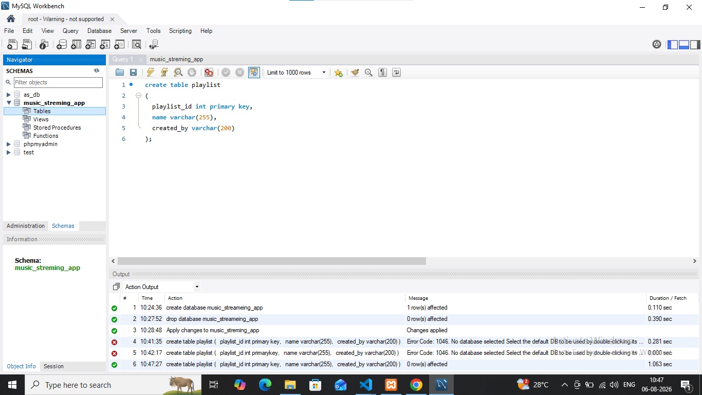

## task2: Inside the 'music_streaming_app' database, create a table called 'playlists' with columns: playlist_id (integer, primary key), name (varchar), and created_by (varchar).

# create table and column in playlist
''' 

'''