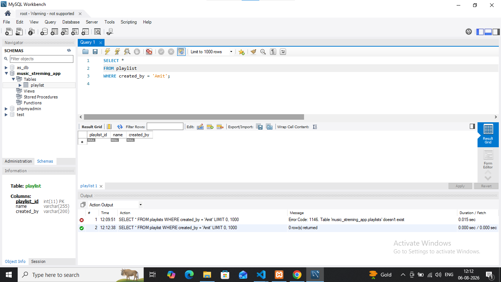

## task 4:Write an SQL SELECT query to display all playlists created by the user 'Amit' from the 'playlists' table.  <em><strong>Hint:</strong> Use the WHERE clause to filter by the 'created_by' column.</em>

# disply cretade by name amit
'''

'''