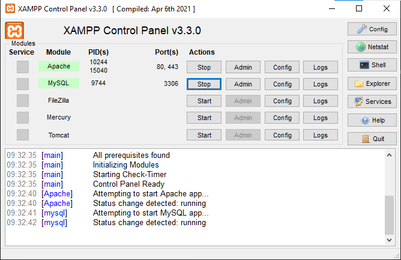
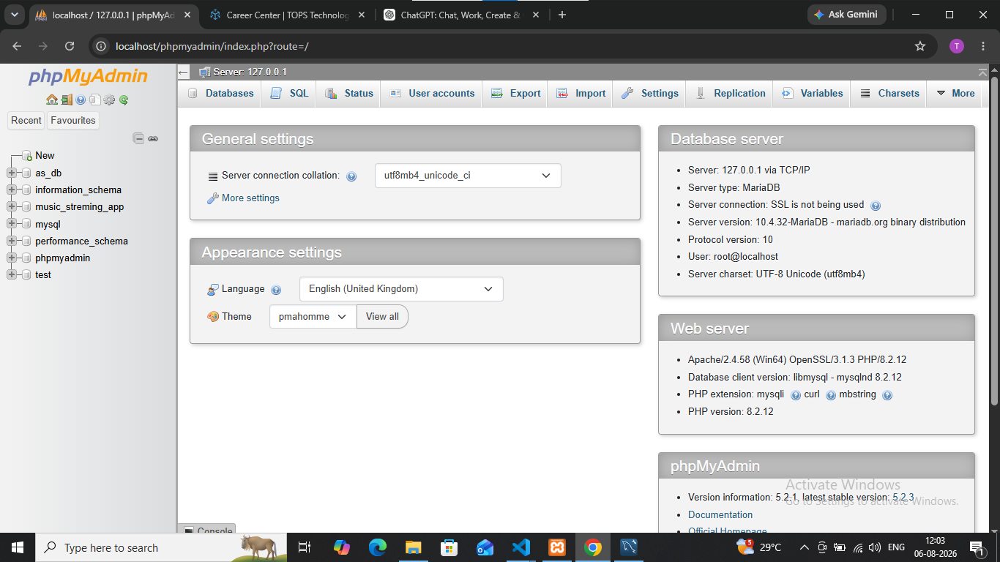

## Install MySQL Community Server or SQLite on your system and verify the installation by connecting to the database using the command line or a GUI tool like MySQL Workbench or DB Browser for SQLite.

# install xampp server ?

'''

'''
# connect server to database 
'''

'''
