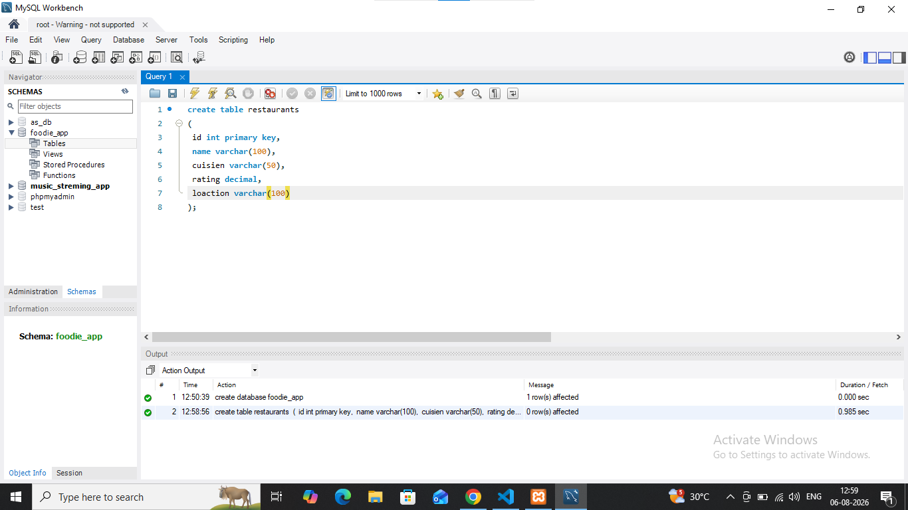

## task 3:Write a CREATE TABLE statement to define a 'restaurants' table in the 'foodie_app' database with the following columns: id (integer, primary key), name (varchar/character, max 100), cuisine (varchar/character, max 50), rating (decimal, e.g., 4.5), and location (varchar/character, max 100).

'''

'''
