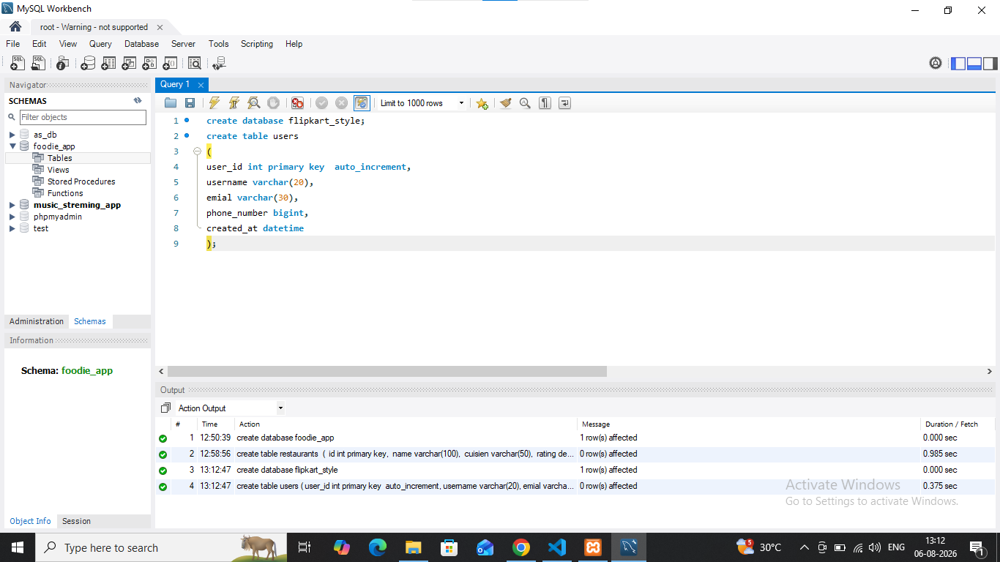

## task 4:Design and create a 'users' table for a Flipkart-style app with columns: user_id (primary key), username, email, phone_number, and created_at (date/time). Pick appropriate data types for each column.  <em><strong>Hint:</strong> Think about which columns should be unique and which data types best fit email and phone numbers.</em>

'''

'''
**query**
'''
create database flipkart_styles
create table users(
user id int primary key auto Increment,
username varchar(28),
enial varchar(30),
phone number bigint,
created at datetime
);
'''
