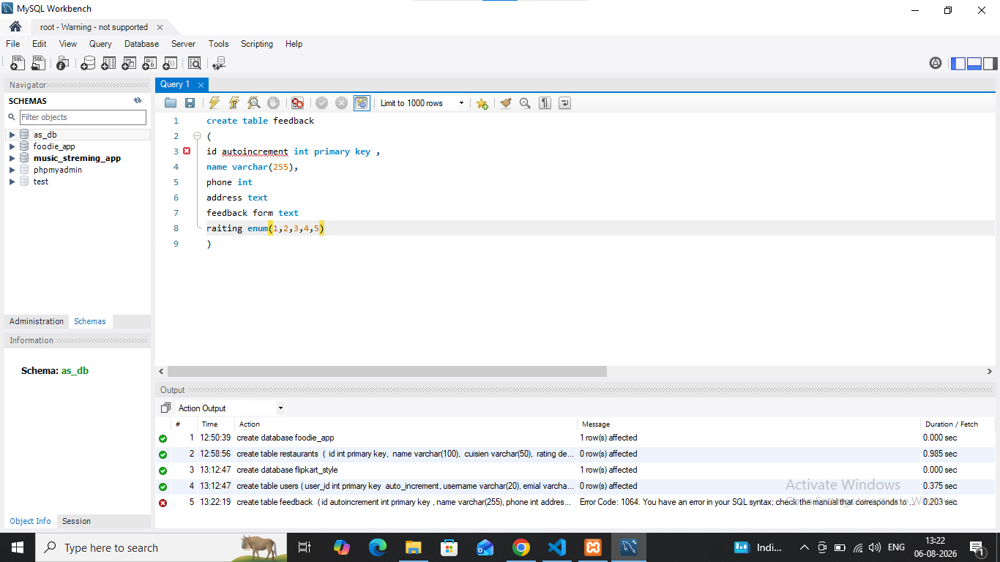
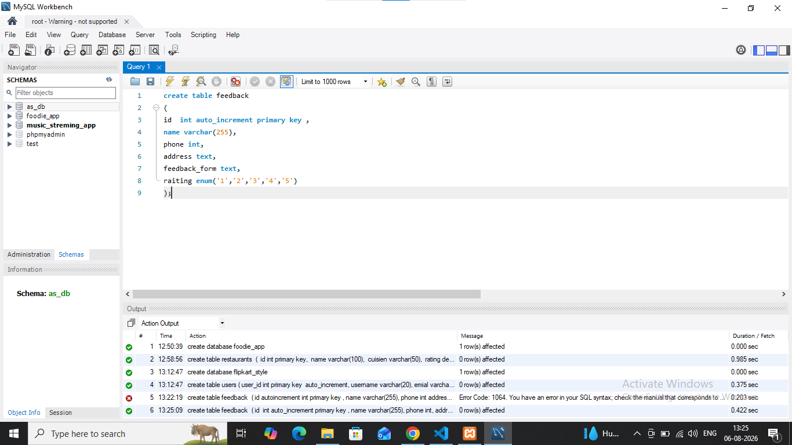

## task 5:Intentionally make a mistake in your CREATE TABLE statement (such as missing a comma or using an unsupported data type), run it, and then fix the error based on the message you receive.  <em><strong>Hint:</strong> Take a screenshot of the error and the corrected SQL statement for your records.</em>

# error task 
'''

'''
# solve error
'''

'''