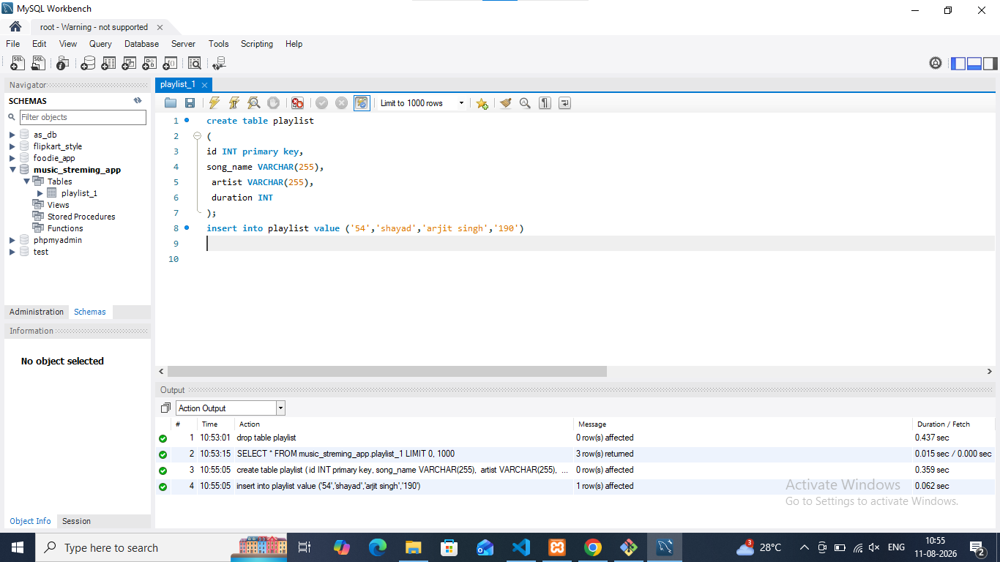

# task 1:Create a table called Playlist with columns: id (INT, primary key), song_name (VARCHAR), artist (VARCHAR), and duration (INT, seconds). Insert a single row for your current favorite song.





**quary**
```
create table playlist
(
id INT primary key,
song_name VARCHAR(255),
 artist VARCHAR(255),
 duration INT 
)
insert into playlist value ('54','shayad','arjit singh','190');
```