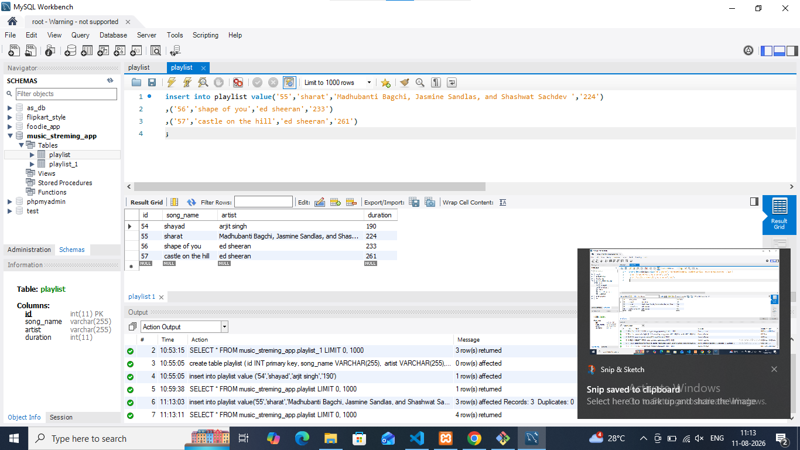

# task 2 :Insert 3 new rows into the Playlist table for songs you recently listened to on Spotify, including their song_name, artist, and duration.



```
insert into playlist value('55','sharat','Madhubanti Bagchi, Jasmine Sandlas, and Shashwat Sachdev ','224')
,('56','shape of you','ed sheeran','233')
,('57','castle on the hill','ed sheeran','261')
;
```