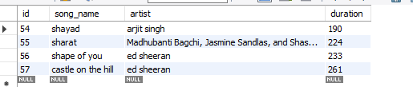
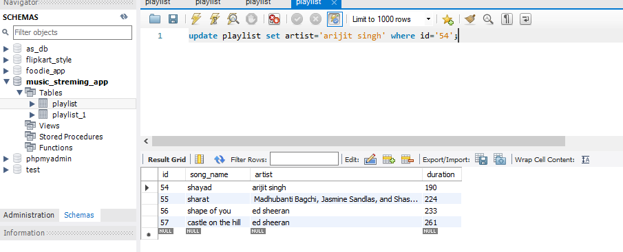

# task 3:Update the artist name for one of your Playlist entries to fix a typo (for example, change 'Arjit Sing' to 'Arijit Singh') using the UPDATE statement with a WHERE clause.

**old name**



**new name**

**quary**
```
update playlist set artist='arijit singh' where id='54';
```
