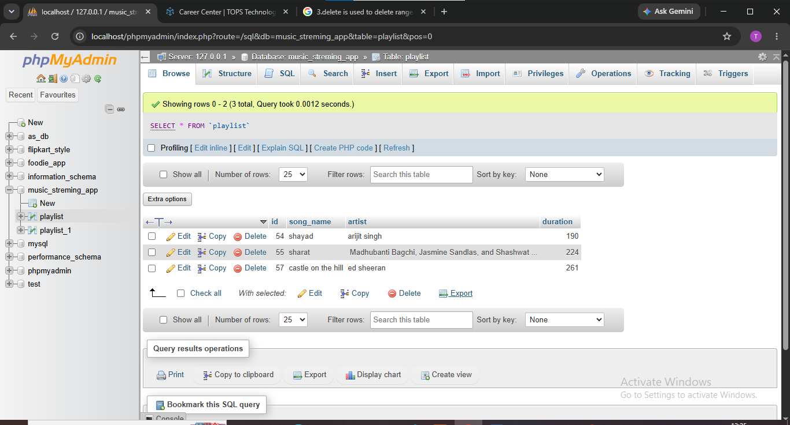

## task 4:Delete a song from the Playlist table where the duration is less than 120 seconds using the DELETE statement and a WHERE clause.<br><br><em><strong>Hint:</strong> Make sure your WHERE clause is specific so you don’t accidentally delete all rows.</em>



**quary**
```
delete from playlist where duration between 0 and 120 ; 
```