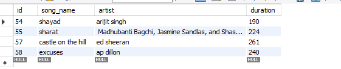
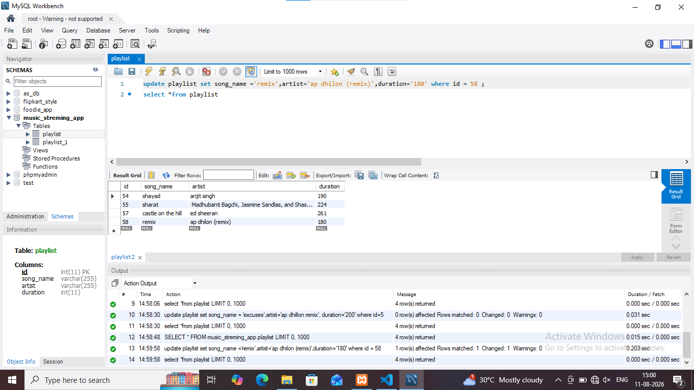

## task 5:Write an SQL statement that would update the song_name for all songs by 'AP Dhillon' in your Playlist to add '(Remix)' at the end of the name, but only if the duration is more than 180 seconds.<br><br><em><strong>Constraint:</strong> Combine UPDATE with WHERE to target only the correct rows.</em>




**quary**
```
update playlist set song_name ='remix',artist='ap dhilon',duration='180' where id = 58
```
