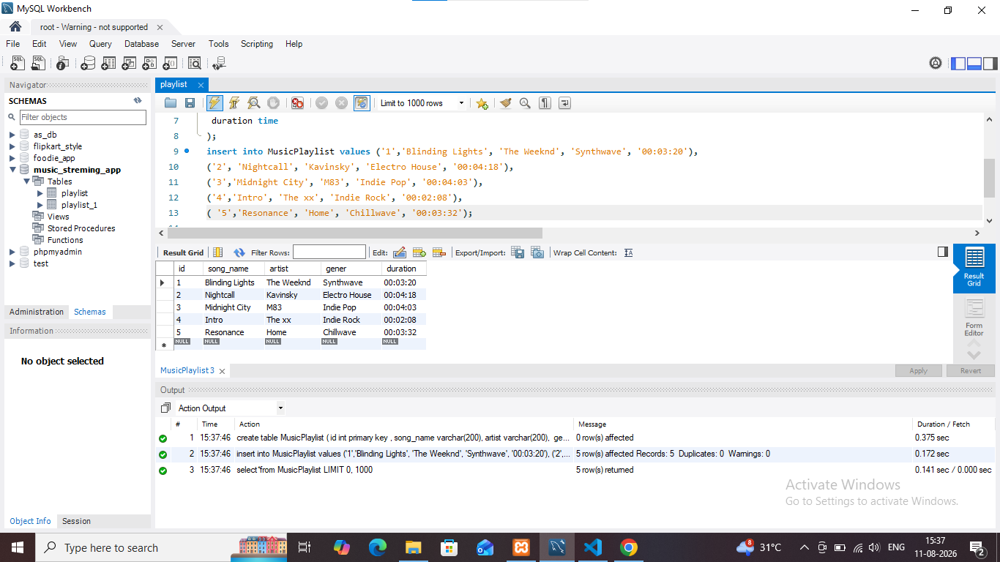

## task 1 :Create a table named MusicPlaylist with columns: id, song_name, artist, genre, and duration. Insert at least 5 records representing songs from your favorite Spotify playlist, then write a SELECT statement to retrieve all columns for all songs.

**quary**
```
create table MusicPlaylist
(
id int primary key,
song_name varchar(200),
artist varchar(200),
 gener varchar(200) ,
 duration time
);
insert into MusicPlaylist value 
('1','Blinding Lights', 'The Weeknd', 'Synthwave', '00:03:20'),
('2', 'Nightcall', 'Kavinsky', 'Electro House', '00:04:18'),
('3','Midnight City', 'M83', 'Indie Pop', '00:04:03'),
('4','Intro', 'The xx', 'Indie Rock', '00:02:08'),
('5', 'Resonance', 'Home', 'Chillwave', '00:03:32');
select*from MusicPlaylist
```

