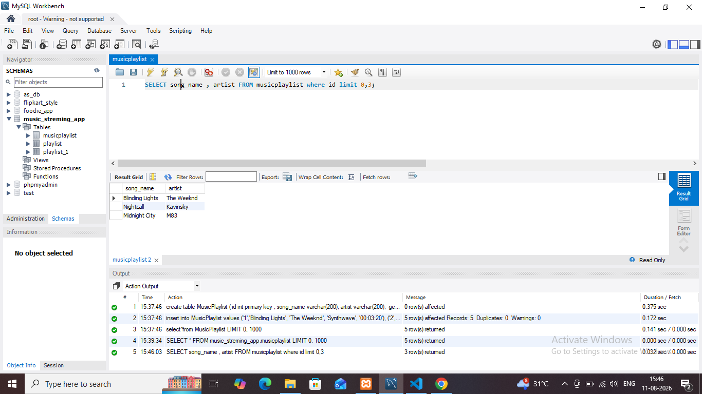

## task 2:Write a SQL query to display only the song_name and artist columns from the MusicPlaylist table, showing just the first 3 records using the LIMIT keyword

**quary**
```
SELECT song_name , artist FROM musicplaylist where id limit 0,3;
```
