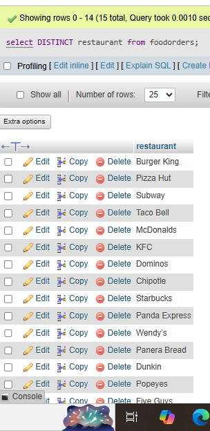

## task 3 :Suppose you have a table named FoodOrders with columns: id, restaurant, food_item, and order_date. Write a SQL query to list all unique restaurant names where you have placed orders, using the DISTINCT keyword.

``` sql
select DISTINCT restaurant from foodorders;
```
