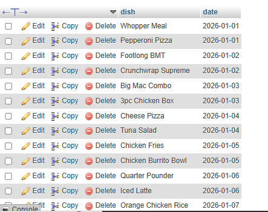

## task4 :Write a SQL query on the FoodOrders table to select food_item as 'Dish' and order_date as 'Date Ordered', displaying only these two columns with the column aliases in the output.

```sql
select food_item as "dish",order_date as"date" from foodorders ;
```

