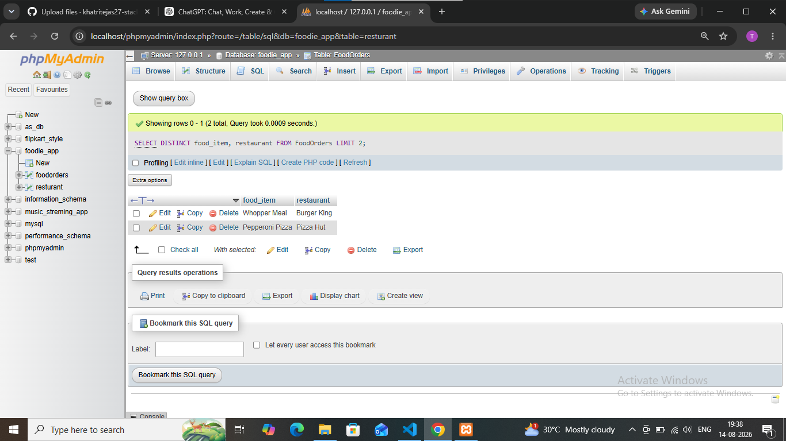

## task 5 :You tried running this query: SELECT DISTINCT food_item, restaurant FROM FoodOrders LIMIT 2, but it returns an error or doesn't work as expected. Identify and fix the mistake in the query.<br><br><em><strong>Hint:</strong> Check the correct placement and usage of the LIMIT keyword in SQL syntax.</em>

```
the quary is already correct. 
There is no mistake in the placement of LIMIT.
'''

```sql
SELECT DISTINCT food_item, restaurant FROM FoodOrders LIMIT 2;
```

 