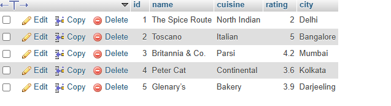

## task 1:Create a table called Restaurants with columns: id, name, cuisine, rating, and city. Insert at least 5 sample records representing real or fictional restaurants you might find on Zomato.

```
create table foodie_app.resturant
(
id int primary key ,
name varchar(255) ,
cuisine varchar(255) ,
 rating float ,
 city varchar(200)
);
insert into resturant value (1, 'The Spice Route', 'North Indian','2', 'Delhi'),
(2, 'Toscano', 'Italian','5', 'Bangalore'),
(3, 'Britannia & Co.', 'Parsi','4.2', 'Mumbai'),
(4, 'Peter Cat', 'Continental','3.6', 'Kolkata'),
(5, 'Glenary’s', 'Bakery', '3.9', 'Darjeeling');
```

