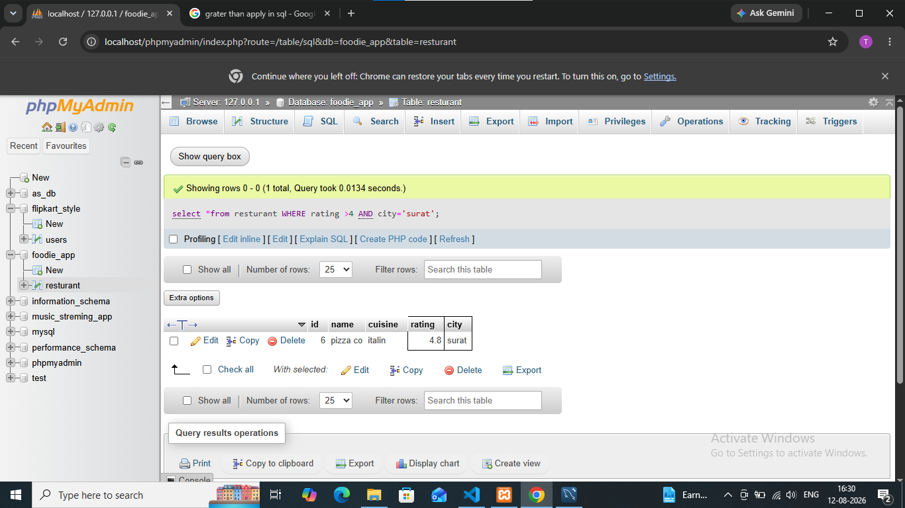

## task 2:Write a SQL query to find all restaurants in the Restaurants table that have a rating greater than 4.0 and are located in either 'Ahmedabad' or 'Surat'.

**quary**
```
select *from resturant WHERE rating >4 AND city='surat' ;
```
