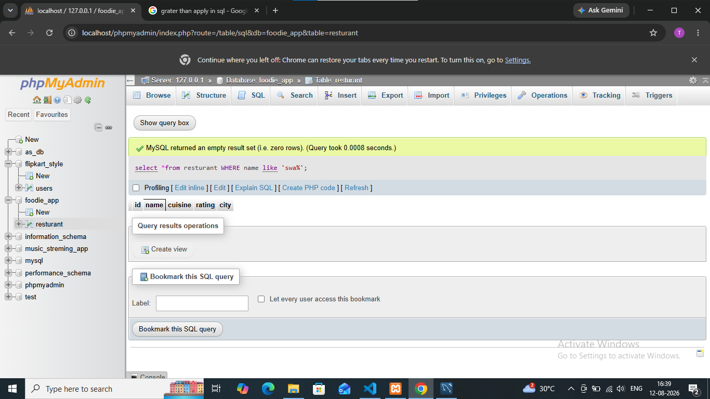
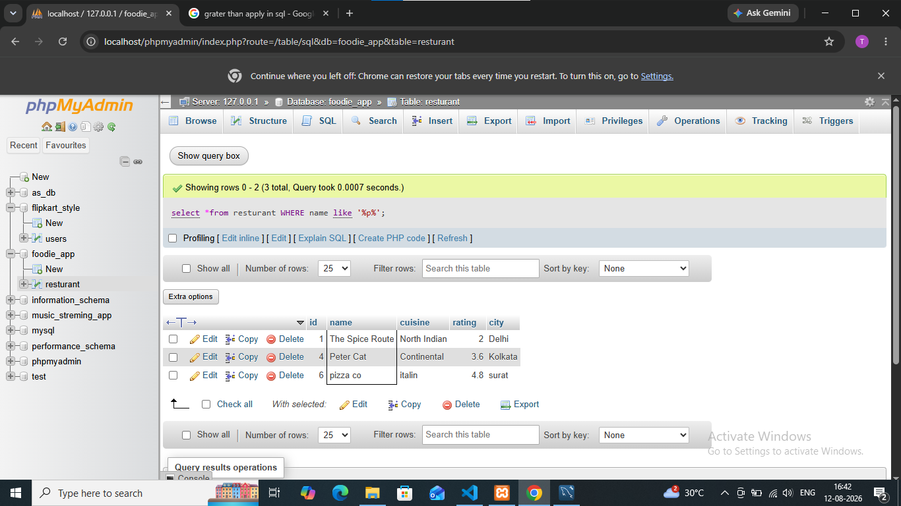

## task 3:Using the LIKE operator, write a query to select all restaurants whose names start with 'Swa' (for example, 'Swagat', 'Swadisht') from the Restaurants table.<br><br><em><strong>Hint:</strong> Use LIKE 'Swa%'.</em>

1 .table no data start from swagat
```
select *from resturant WHERE name like 'swa%';
```


2.
```
select *from resturant WHERE name like '%p%';
```
