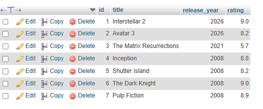
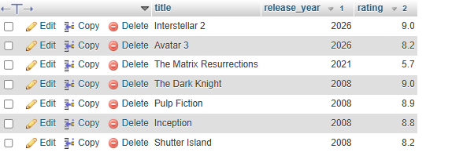

## Tasks 3:Given a 'movies' table with columns 'title', 'release_year', and 'rating', write an SQL query to list all movies sorted first by release_year in descending order (latest first), then by rating in descending order (highest rated first).

#create table movies

 

```sql
 select *from movies order by release_year desc, rating  desc
 ```
 