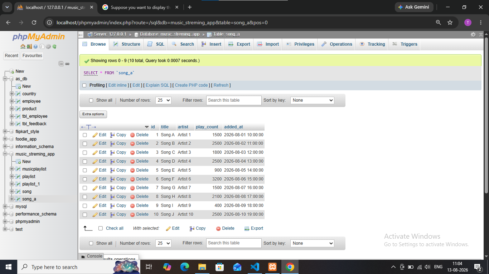
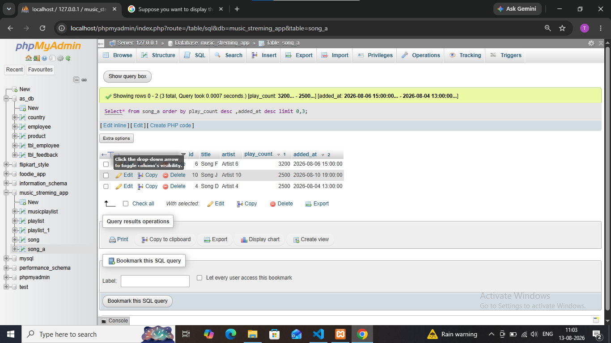

## Tasks 5:Suppose you want to display the top 3 trending songs from a 'songs' table based on play_count, but if two songs have the same play_count, the more recently added song should come first. Write the SQL query to achieve this.<br><br><em><strong>Hint:</strong> Use ORDER BY with multiple columns.</em>

# create table songs 


**sql query in answer**
``` sql
Select* from songs order by play_count desc ,added_at desc limit 0,3 ;
```

