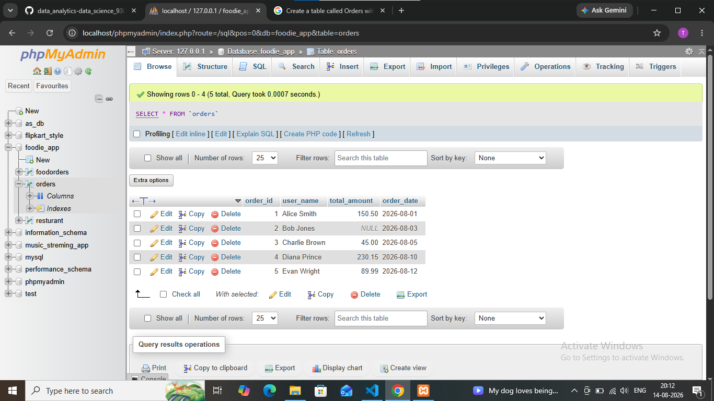

## task 1:Create a table called Orders with columns: order_id, user_name, total_amount, and order_date. Insert 5 sample rows with different users and order amounts, including at least one NULL value for total_amount.

```sql
-- create table 
create table orders (
 order_id int PRIMARY KEY,
 user_name varchar(255),
 total_amount decimal (10,2),
 order_date date 
);
-- insert 5 sample rows
INSERT INTO orders VALUES
(1, 'Alice Smith', 150.50, '2026-08-01'),
(2, 'Bob Jones', NULL, '2026-08-03'),
(3, 'Charlie Brown', 45.00, '2026-08-05'),
(4, 'Diana Prince', 230.15, '2026-08-10'),
(5, 'Evan Wright', 89.99, '2026-08-12');
```

