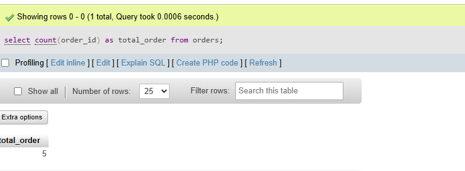

## task 2:Write a SQL query to count how many orders were placed by each user in the Orders table, displaying user_name and the number of orders as order_count.

```sql
select count(order_id) as total_order from orders
```
