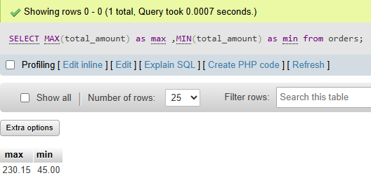

## task 4:Suppose you are building a Flipkart-style dashboard: Write a SQL query to find the highest and lowest order amounts (MAX and MIN) from the Orders table, and display both values in a single result row.

```sql
SELECT MAX(total_amount) as max ,MIN(total_amount) as min from orders;
```

