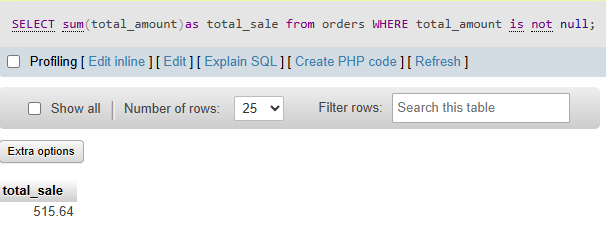

## task 5:Write a SQL query to calculate the total sales (SUM of total_amount) for all orders, but only include orders where total_amount is not NULL.<br><br><em><strong>Hint:</strong> Use a WHERE clause to filter out NULL values before applying the SUM function.</em>

```sql
SELECT sum(total_amount)as total_sale from orders WHERE total_amount is not null
```

