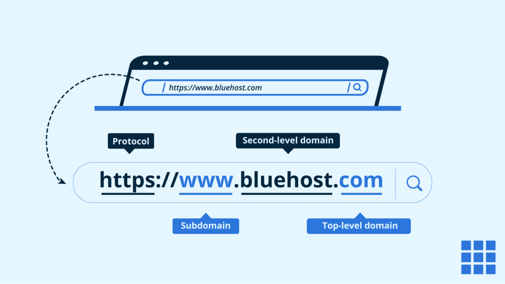

# what is URL explain all types  of URL  ? 

## what is URL  ??

1. URL stands for universal resource locator  
2. URL is for any website search content on web there we used URL
3. URL write in formate of 

  ```
   http://www.raviflutes.com/
  ```
## types of URL 

   1. absolute URL 
      - open any website of landing page or home page i.e absolute URL 
      - http://www.raviflutes.com/ 

   2. relative URL 
      - relative URL is used to open web pages of any web applications ie. called relative UR 
      - https://www.raviflutes.com/login
      - https://www.raviflutes.com/register
      - https://www.raviflutes.com/products 


## architectures of URL  


  