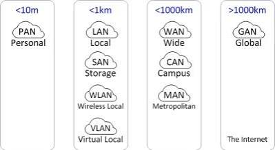
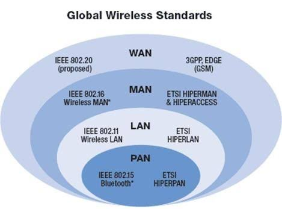

# LAN, MAN, and WAN

## 1. LAN (Local Area Network)

### Definition
A **Local Area Network (LAN)** is a network that connects computers and devices within a **small geographical area**, such as a home, school, office, or building.

### Characteristics
- Covers a small area.
- High data transfer speed.
- Privately owned and managed.
- Low installation and maintenance cost.

### Examples
- Home Wi-Fi network.
- School computer lab.
- Office network.

### Advantages
- Fast communication.
- Easy file and printer sharing.
- Low latency.
- Secure because it is privately managed.

### Disadvantages
- Limited coverage area.
- Requires network equipment like switches and routers.

---

## 2. MAN (Metropolitan Area Network)

### Definition
A **Metropolitan Area Network (MAN)** connects multiple LANs within a **city or metropolitan area**.

### Characteristics
- Covers an entire city or large campus.
- Faster than WAN but slower than LAN.
- Usually managed by government agencies, universities, or Internet Service Providers (ISPs).

### Examples
- City-wide cable TV network.
- University campuses connected across a city.
- Government office networks within a city.

### Advantages
- Covers a larger area than LAN.
- High-speed communication across the city.
- Supports sharing of resources among multiple locations.

### Disadvantages
- More expensive than LAN.
- More complex to manage.
- Security is more challenging.

---

## 3. WAN (Wide Area Network)

### Definition
A **Wide Area Network (WAN)** connects computers and networks over **large geographical distances**, such as countries or continents.

### Characteristics
- Covers very large areas.
- Connects multiple LANs and MANs.
- Uses public and private communication networks.
- Lower speed compared to LAN due to long-distance communication.

### Examples
- The Internet.
- Bank networks connecting branches nationwide.
- Multinational company networks.

### Advantages
- Connects users worldwide.
- Enables remote access to data and services.
- Supports global communication.

### Disadvantages
- Higher installation and maintenance costs.
- Slower than LAN.
- Greater security risks.

---

# Comparison Table

| Feature | LAN | MAN | WAN |
|---------|-----|-----|-----|
| Full Form | Local Area Network | Metropolitan Area Network | Wide Area Network |
| Coverage | Small area (building, office) | City or metropolitan area | Country or worldwide |
| Speed | High | Medium to High | Lower than LAN |
| Cost | Low | Medium | High |
| Ownership | Private | Private or Public | Public or Private |
| Example | Home Wi-Fi | City-wide university network | Internet |

---

# Simple Diagram

```text
LAN
+--------------------+
| Office / Home      |
| PC ---- Switch     |
|  |        |        |
| Laptop  Printer    |
+--------------------+

        │
        ▼

MAN
+--------------------------------------+
| City Network                         |
| LAN 1 ---- LAN 2 ---- LAN 3          |
+--------------------------------------+

        │
        ▼

WAN
+---------------------------------------------------+
| Country / World                                   |
| City A ----- City B ----- City C ----- Internet   |
+---------------------------------------------------+
```

---

# Summary

- **LAN** is used for networking within a small area like a home or office.
- **MAN** connects multiple LANs across a city.
- **WAN** connects networks over large distances, such as countries or the entire world.

The **Internet** is the largest example of a **WAN**.



