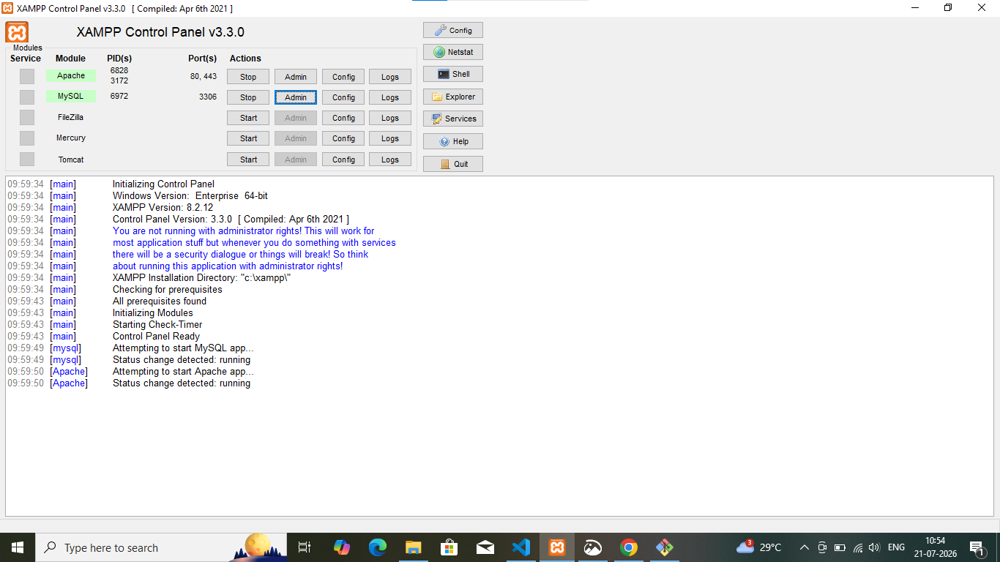
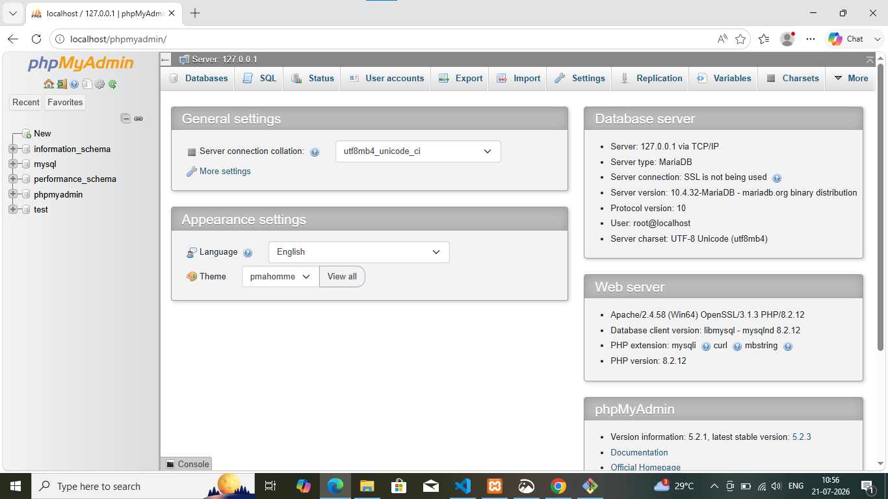
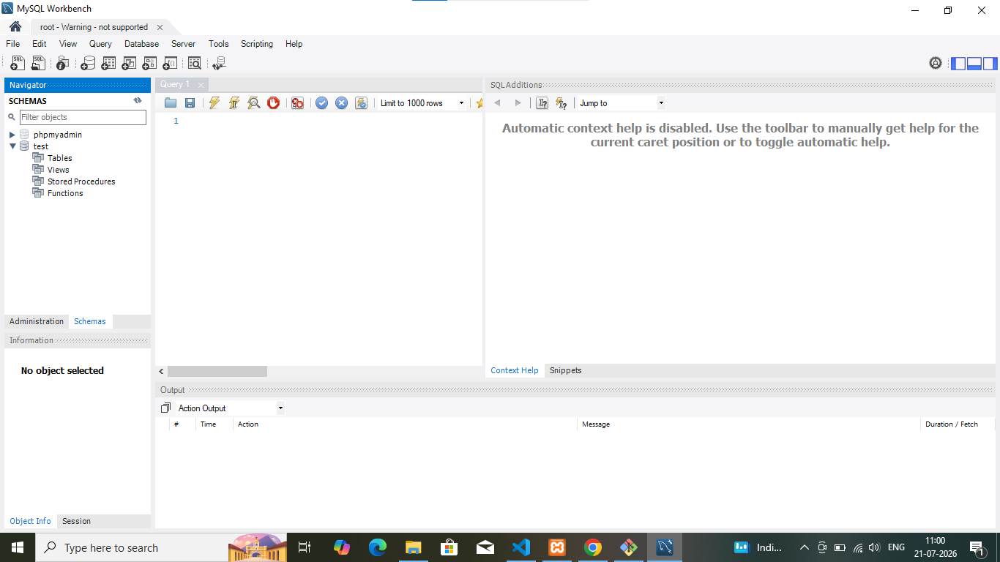

#what is dbms?
1.DBMS stand for database management
2.DBMS create  database manage database
3.DBMS is also create and manage database via MYSQL |
MYSQLworkbech
4.hoe to install xampp and open my SQL
**screenshort**

5.how to install MYSQLworkbech and open it 

##what is database
1.database stored an information about data in form of table i.e called database
2.database stored information i.e called database
3.database create via SQL

# what is RDBMS?
 1. RDMS stands for relactional database management system 
 2. RDMS is used to provide relactional b/w two databases
 3. RDMS is used to  stabilish relactional databases
 

 
