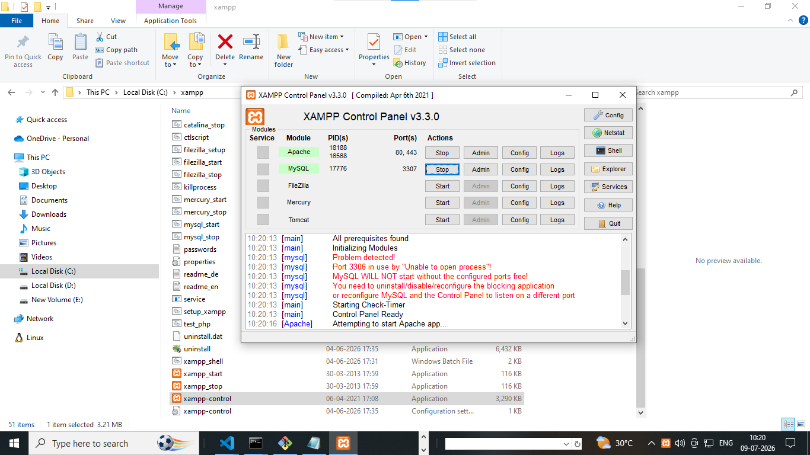
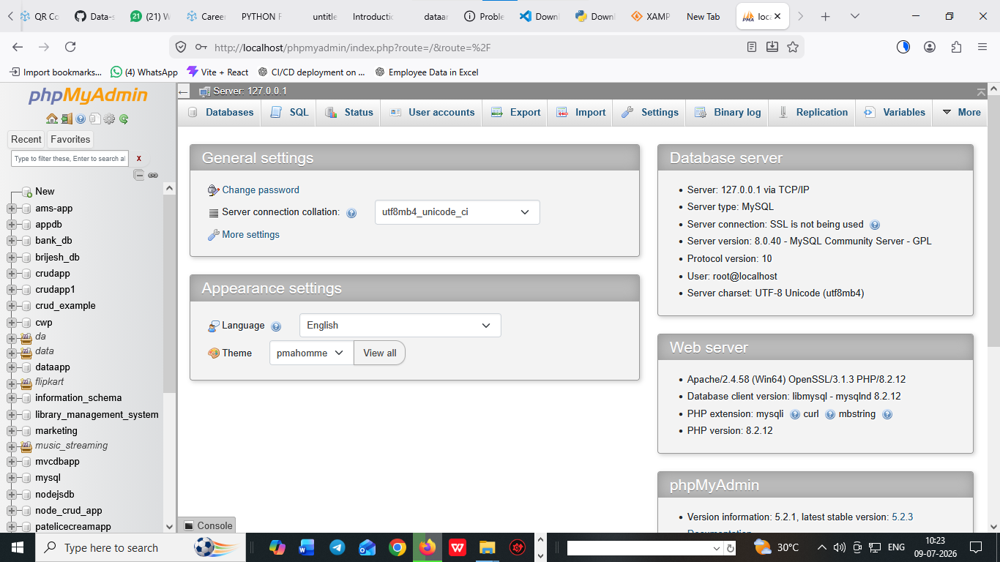
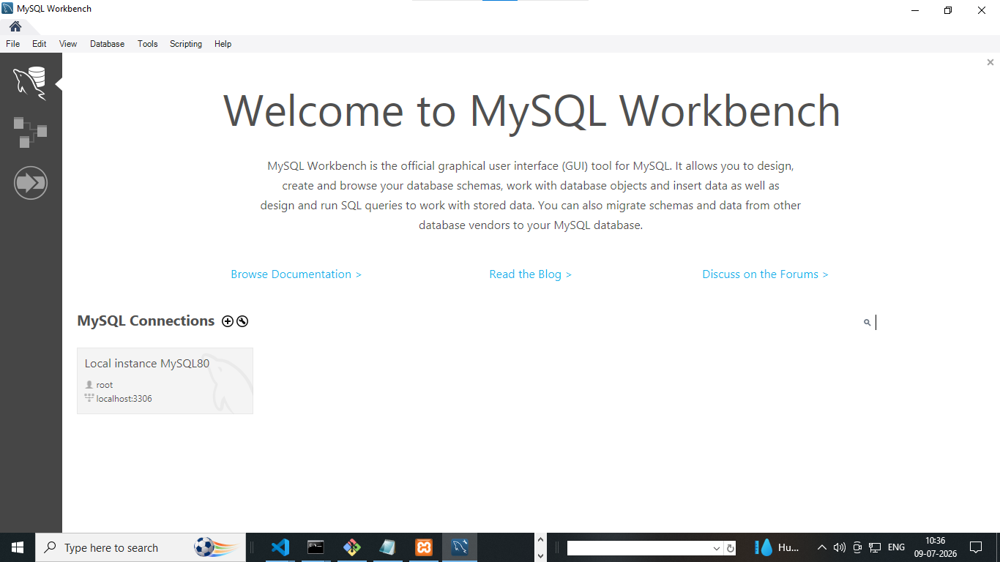

# download and install IDE (integrated device environment)
  - List of IDE 
  1. visual studio code 
     ```
     https://code.visualstudio.com/download

     ```

# download python and install python 
  
   ```
   https://www.python.org/downloads/

   ```
   1. download and install from following url
   2. open terminal and check python is install or not 
   3. cmd ....
   4. check version 

     ```
    E:\data_analytics&data_science_930am\data_analytics\software-installation>python
    Python 3.14.6 (tags/v3.14.6:c63aec6, Jun 10 2026, 10:26:10) [MSC v.1944 64 bit (AMD64)] on win32
    Type "help", "copyright", "credits" or "license" for more information.
    >>>

     ```
   
    
# download xampp server for database 

   1. download from https://www.apachefriends.org/
   2. download and install for SQL and database 
   3. open xampp from c drive 
   4. open xampp-control and start xampp server

   

   5. open any broswers 
   6. localhost/phpmyadmin

   


# download mysqlWorkbench8.0 and install it 

   1. download mysqlworkbench8.0 and install 

      ```
      https://dev.mysql.com/downloads/workbench/

      ```

    2. download and install mysqlworkbench8.0 and install it 


 
